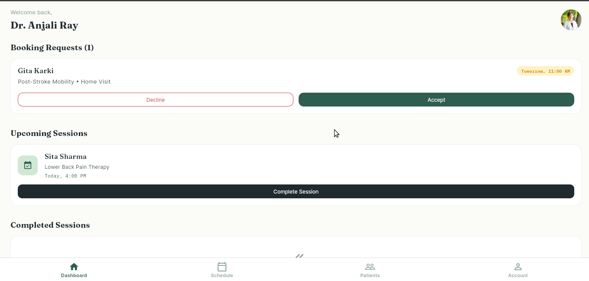
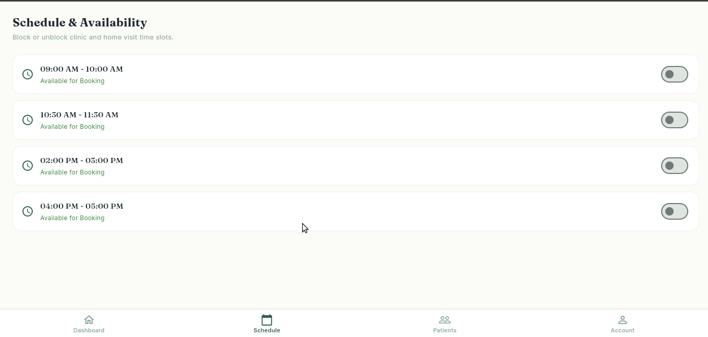
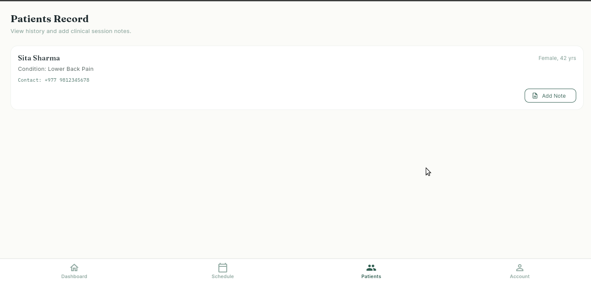
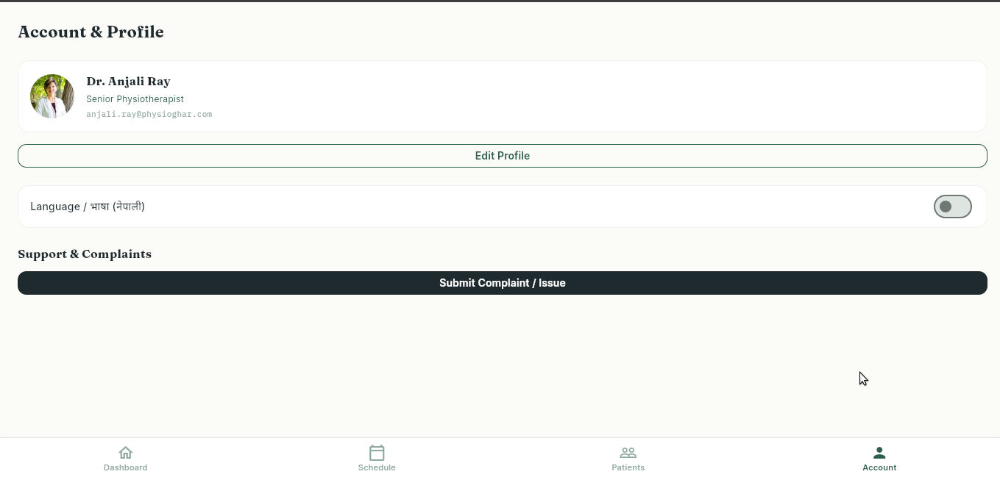
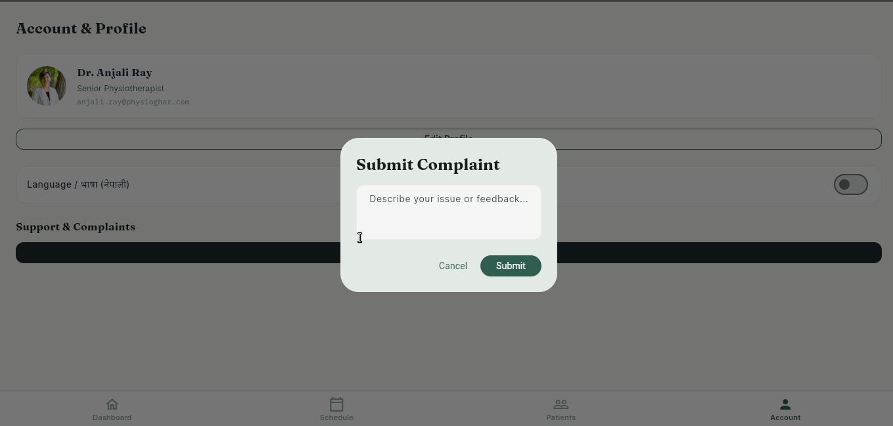

# 🏥 PhysioGhar Therapist App

PhysioGhar is a **platform connecting patients with physiotherapists** for home and clinic-based physiotherapy services.  
This repository contains the **Flutter prototype of the Therapist App**, built to demonstrate UI implementation, navigation, state management, reusable components, and user interaction handling.

---

## 📌 Features

- **[Therapist Dashboard](ca://s?q=PhysioGhar_Therapist_Dashboard)**: Overview of appointments, patients, and tasks.  
- **[Booking Management](ca://s?q=PhysioGhar_Booking_Management)**: Accept, reject, or reschedule patient bookings.  
- **[Complaint Reporting](ca://s?q=PhysioGhar_Complaints_Feature)**: Therapists can report issues (patient, booking, payment, technical).  
- **[Profile & Settings](ca://s?q=PhysioGhar_Therapist_Profile_Settings)**: Manage therapist details and preferences.  
- **[Navigation & Routing](ca://s?q=PhysioGhar_Flutter_Navigation)**: Smooth transitions between app sections.  
- **[Reusable Components](ca://s?q=PhysioGhar_Flutter_Reusable_Components)**: Consistent UI elements across screens.  

---

## 🛠️ Tech Stack

- **[Flutter](ca://s?q=Flutter_framework_overview)** (Dart) for cross-platform mobile development  
- **[Material Design](ca://s?q=Flutter_Material_Design_UI)** for UI components  
- **[State Management](ca://s?q=Flutter_state_management_options)** with `StatefulWidget` and `setState` (prototype level)  
- **[Navigation](ca://s?q=Flutter_navigation_routing)** using `Navigator` and `MaterialPageRoute`  

---

## 🚀 Getting Started

### Prerequisites
- Install [Flutter SDK](ca://s?q=Install_Flutter_SDK) (latest stable version)  
- Install [Android Studio](ca://s?q=Install_Android_Studio) or [VS Code](ca://s?q=Install_VS_Code) with Flutter/Dart plugins  
- Ensure a connected device or emulator is available  

### Installation
```bash
# Clone the repository
git clone https://github.com/Cheetah-napalm/Physio-Ghar-App.git

# Navigate into the project
cd Physio-Ghar-App

# Get dependencies
flutter pub get

# Run the app
flutter run

Project Structure

lib/
 ├── main.dart              # Entry point
 ├── theme/                 # Colors & text styles
 ├── screens/                 # Screens (Dashboard, Complaints, Profile, etc.)
 ├── widgets/               # Reusable UI components
 └── models/                # Data models (Booking, Complaint, Therapist)


This prototype focuses on:

Core therapist workflows (appointments, complaints, profile)

Functional navigation & UI polish

Basic validation and user feedback (SnackBars, error messages)

⚠️ Note: Backend integration, authentication, and advanced features are not included in this prototype.

Screenshots





